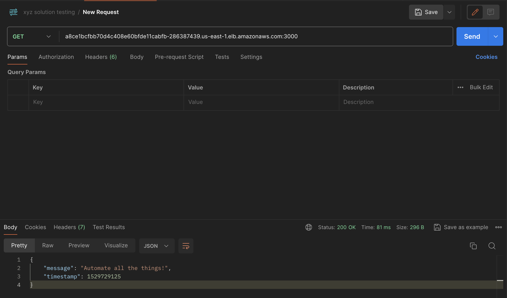

### Prerequisite
* Install terraform
* Install kubectl

# Instructions on how to run the application
* clone the repo to your local machine and navigate to the folder

* to setup the aws eks infrastructure, navigate into the aws_kubernetes_infra folder and run the following commands
    * `terraform init`
    * `terraform apply`

* Run the following command to point kubectl to your provisioned eks cluster
    `aws eks --region $(terraform output -raw region) update-kubeconfig --name $(terraform output -raw cluster_name)`

* Navigate back to the root folder and run the following command:
    `kubectl apply -f=deployment.yaml -f=service.yaml`

* Verify that the pods have been created and the container in running on the pod
* Once verified, you can get the externalIP of the service to run the application

